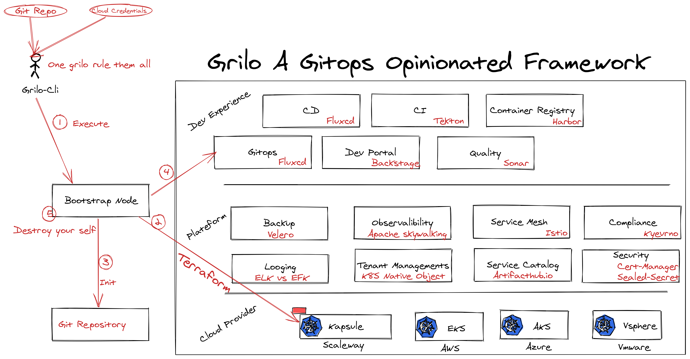

#  Grilo - A Gitops Opinionated Framework

## Overview

Grilo was born to join the gitops mouvement and offer a piece that can help developers to boostrap complete k8s cluster focusing on enhancing the Dev and Ops Experience .

- Why another gitops Framework :
    - Many repetitive and boring tasks when boostraping a new cluster : install Istio , install monitoring stack , creating policies ...
    - No standard way to create a gitops repository .
    - Full Gitops from start to end when `real cluster = git state` can be a reality .
    - Collecting carrefully CNCF and some wonderfull OSS project can give world class experience and decorate your naked `k8s` cluster
    - We have an opinion 😂

## Design

## Contributing

We encourage contributions to Grilo from the community. Here’s how to get started.

- Fork the project
- Create a branch
- Make your changes and run the functional and integration test suite
- Commit your changes and push them to your fork
    - Please interactively rebase your commits to aid review
- Open pull-requests for you changes
- We will review your pull-request, suggest changes, and merge it when it’s ready and/or offer feedback

To report a bug or issue, please register and open a new issue on github . 

### Licensing

TODO
